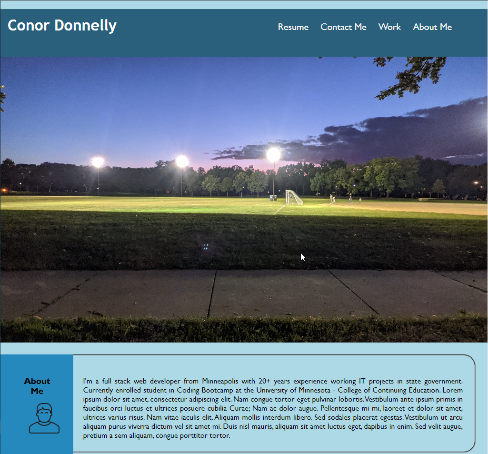

# 02-Challenge-Portfolio: Web Porfolio
# Submitted by Conor Donnelly - September 12, 2022

This challenge required us to write code from scratch in order to demonstrate what we've learned so far
with HTML and CSS in order to create a web portfolio that can highlight our skills and showcase our projects.

## Page URL
(https://riversidempls.github.io/02-Challenge-Portfolio)

## Screenshot

